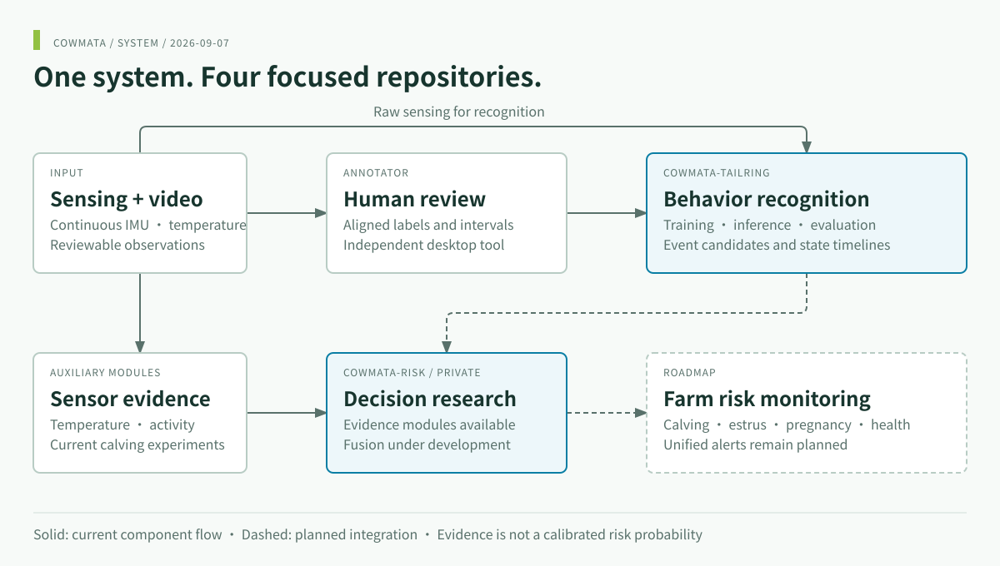
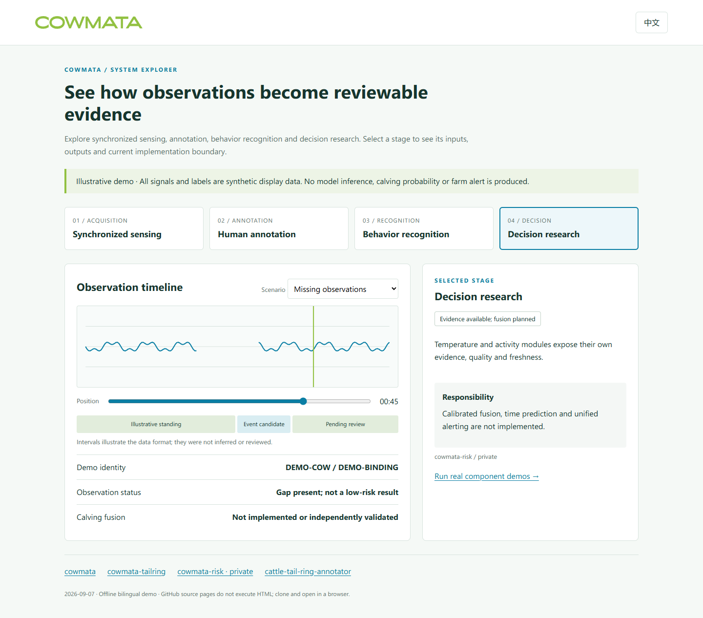

<div align="center">
<a href="https://www.cowmata.com/"></a>

# COWMATA · Cattle Monitoring

**From tail-ring sensing to reviewable behavior and risk evidence.**

[](https://github.com/zxq309/cowmata/actions/workflows/docs.yml)


[English](README.md) · [简体中文](README.zh-CN.md) · [COWMATA](https://github.com/zxq309/cowmata)

</div>


*Concept illustration, not a deployed application screenshot.*

## Latest update

**2026-09-07** — Centralized products, application context, team, research progress and repository responsibilities; specialist portals retain a single project-overview link. [Full changelog](CHANGELOG.md).

## What this project does

COWMATA is a smart cattle tail-ring and companion software project developed by Yangling Yuanshangyuan Intelligent Technology Co., Ltd. It covers cattle reproduction, behavior and health monitoring. The sensor captures nine-axis IMU together with temperature and PPG; synchronized video provides reviewable evidence for behavior and calving events.

The project aims to turn continuous observations into behavior timelines and risk evidence for farm reproductive management and health observation. Calving is the current research and field-experiment priority; estrus, pregnancy and health/disease-risk monitoring are separate follow-on research tasks.

**This repository is the single project overview:** products, application context, team, progress and component responsibilities. The three specialist repositories focus on their own functionality, interfaces, usage and validation.

## Hardware and application context

The tail-ring worn near the tail root is the sensing entry point, supported by synchronized video annotation, behavior recognition and decision research. Existing product imagery represents farm and veterinary editions.

<table><tr><td align="center" width="50%"><br>Farm edition</td><td align="center" width="50%"><br>Veterinary edition</td></tr></table>

| Product / component | Intended context | Role in the project |
|---|---|---|
| Tail-ring · farm edition | Farm reproductive management and daily observation | Continuous sensing for estrus, pregnancy and calving monitoring research |
| Tail-ring · veterinary edition | Reproductive and animal-health observation | Auxiliary observations for professional review and research |
| Video–IMU annotator | Data collection, experiments and review | Align video/signals and produce traceable state/event labels |
| Recognition and decision software | Algorithm development and evaluation | Produce behavior events and multimodal auxiliary evidence respectively |

A complete farm service, business frontend/backend and unified alert deployment have not been delivered by these four repositories. Product information: [COWMATA website](https://www.cowmata.com/); provenance and usage terms: [assets/README.md](assets/README.md).

## Research progress and capability boundaries

| Direction | Available today | Next step |
|---|---|---|
| Behavior/event recognition | Continuous-IMU training/inference baseline, review workflow and cow-level evaluation | More labels, hard negatives and independent validation |
| Calving | Temperature/activity evidence modules and ongoing field experiments | Event integration, fusion calibration and continuous-warning validation |
| Estrus and pregnancy | Project research and data-collection directions | Task-specific ground truth, models and independent evaluation |
| Health/disease risk | Multimodal data and feasibility-research direction | Quality assessment, control data and task validation |

Auxiliary evidence is not a calibrated calving probability; a product direction is not a completed diagnostic capability. Specialist repositories record specific software and experiment versions.

## Four repositories, one project

| Repository | Responsibility |
|---|---|
| [cowmata](https://github.com/zxq309/cowmata) | System architecture, roadmap and demos |
| [cowmata-tailring](https://github.com/zxq309/cowmata-tailring) | Behavior/event training, inference and evaluation |
| [cowmata-risk](https://github.com/zxq309/cowmata-risk) | Decision research; private, authorized access |
| [cattle-tail-ring-annotator](https://github.com/zxq309/cattle-tail-ring-annotator) | Annotation and human review |

## Current system architecture



## Explore the system demo

**[Open the live interactive demo →](https://zxq309.github.io/cowmata/demo/?lang=en)** — no installation required. The same page also works offline.



Clone this repository and open **[demo/index.html](demo/index.html)** in a browser. It works offline, switches between English and Chinese, and shows normal, changing-evidence and missing-data scenarios. All displayed values are illustrative; no recognition or risk model runs in this page.

```sh
git clone https://github.com/zxq309/cowmata.git
cd cowmata
python -m http.server 8000 --bind 127.0.0.1
# Open http://127.0.0.1:8000/demo/
```

For **actual component execution**, see [the demo guide](docs/DEMO.md). The runner invokes the recognition demo and optionally the authorized risk demo, records component commits and returns failure if a selected component fails. It does not pretend that the components form a validated fused pipeline.

## Documentation and reproducibility

- [Roadmap](docs/ROADMAP.en.md) · [Interface proposal](docs/INTERFACES.en.md)
- [Pinned component commits](components.json) · [Maintenance](docs/MAINTENANCE.en.md)
- [Demo guide](docs/DEMO.md) · [Asset provenance](assets/README.md)
- [Contributing](CONTRIBUTING.md) · [Security](SECURITY.md) · [Notice](NOTICE)

## Team

The development company is **Yangling Yuanshangyuan Intelligent Technology Co., Ltd.**, under the **COWMATA** brand. Team information is maintained here; component contribution and citation records remain in their owning repositories.

| Member | Role / affiliation in existing project credits |
|---|---|
| Xiangqing Zhang | CTO, Yangling Yuanshangyuan Intelligent Technology Co., Ltd.; Yan'an University |
| Yalong Zhang | Founder, Yangling Yuanshangyuan Intelligent Technology Co., Ltd. |
| Tengyu Jiao | Yan'an University |
| Yachen Zhao | Yan'an University |


Company/product inquiries: [official contact page](https://www.cowmata.com/contact/). Reproducible software issues belong in the relevant specialist repository; cross-component interfaces and overall roadmap discussions belong here.
