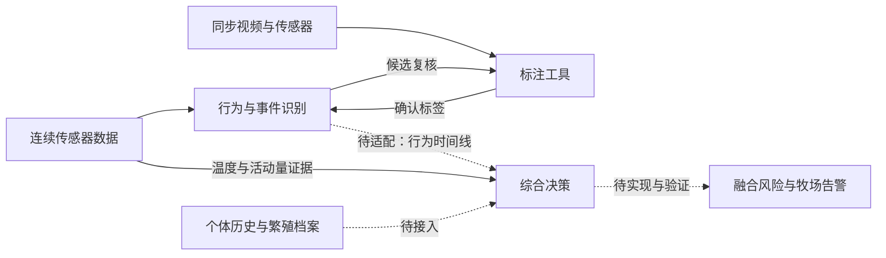

# COWMATA · 牛只繁殖与健康监测

COWMATA 面向尾环多模态感知、牛只行为识别和繁殖与健康风险监测。本仓是总体项目入口，维护系统架构、路线图、组件职责和集成版本。

## 四个仓库

| 仓库 | 职责 | 当前状态 |
|---|---|---|
| [cowmata](https://github.com/zxq309/cowmata) | 总体架构、路线图、版本与集成说明 | 本仓 |
| [cowmata-tailring](https://github.com/zxq309/cowmata-tailring) | 行为与事件识别的训练、推理、评估 | 已有算法基线 |
| [cowmata-risk](https://github.com/zxq309/cowmata-risk) | 辅助证据、长期风险与预警决策 | 私有；产犊实验中，温度/活动量模块已接入 |
| [cattle-tail-ring-annotator](https://github.com/zxq309/cattle-tail-ring-annotator) | 视频与传感器标注、候选复核、导出 | 独立迭代 |

私有决策仓仅授权成员可访问。总体项目愿景包含发情、产犊、妊娠与健康风险；这不代表上述能力均已实现或经独立验证。

## 系统关系

当前可以分别运行标注工具、识别基线与两个决策辅助模块；完整端到端预警部署尚未建立。

## 从哪里开始

- 做标注：进入标注仓，按其安装与导出说明操作。
- 训练或评估行为模型：进入识别仓，按其数据合同和独立牛评估流程操作。
- 做产犊实验：授权成员进入决策仓，运行两模块测试与合成数据示例。
- 查看整体安排：[路线图](docs/ROADMAP.md)、[维护约定](docs/MAINTENANCE.md)。
- 查看组件基线：[components.json](components.json)；它记录来源版本，不等于已验证兼容组合。
- 查看跨仓接口：[协议提案](docs/INTERFACES.md)。

本仓引用组件，不复制其源码、模型或原始实验数据。暂不引入子模块和微服务部署；组件通过版本化包与数据格式衔接。
