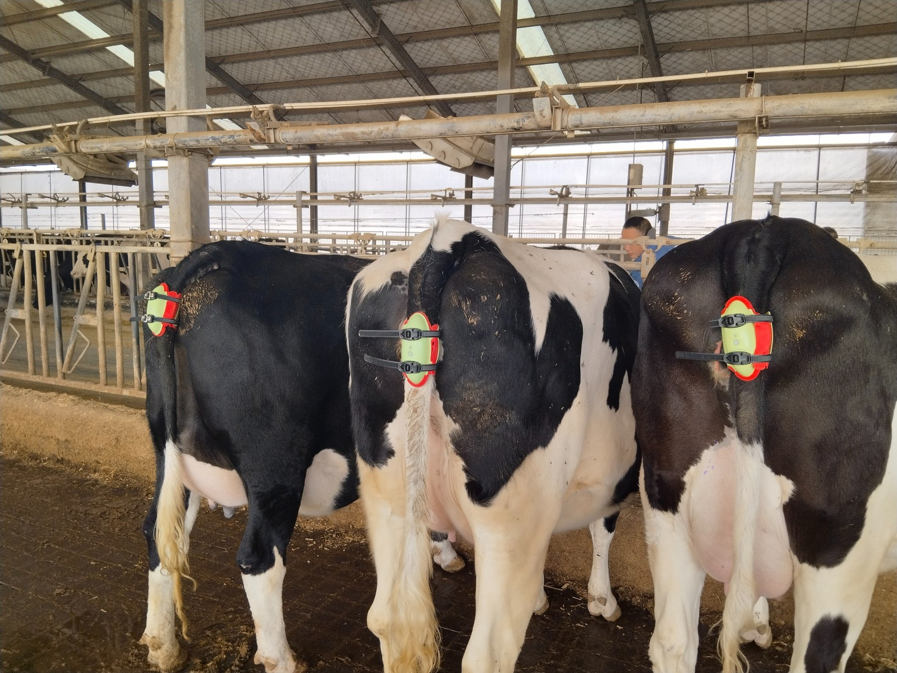
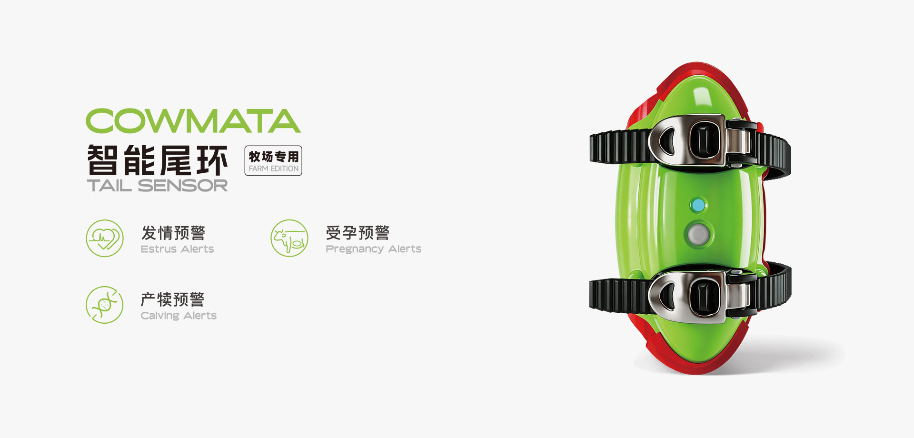
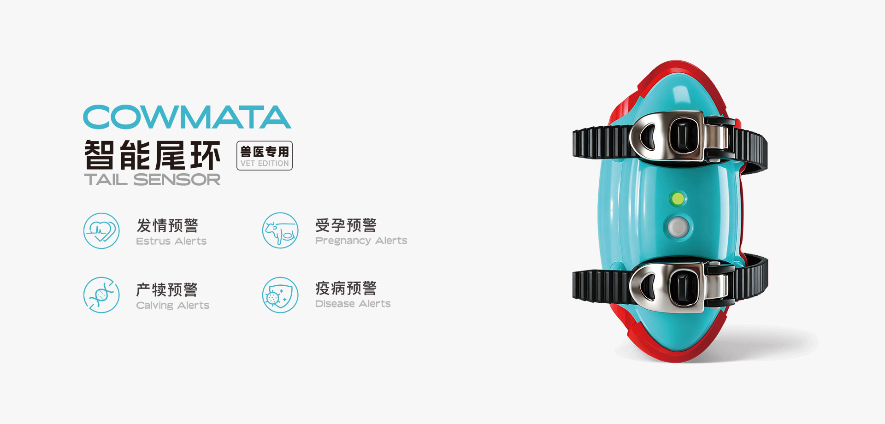
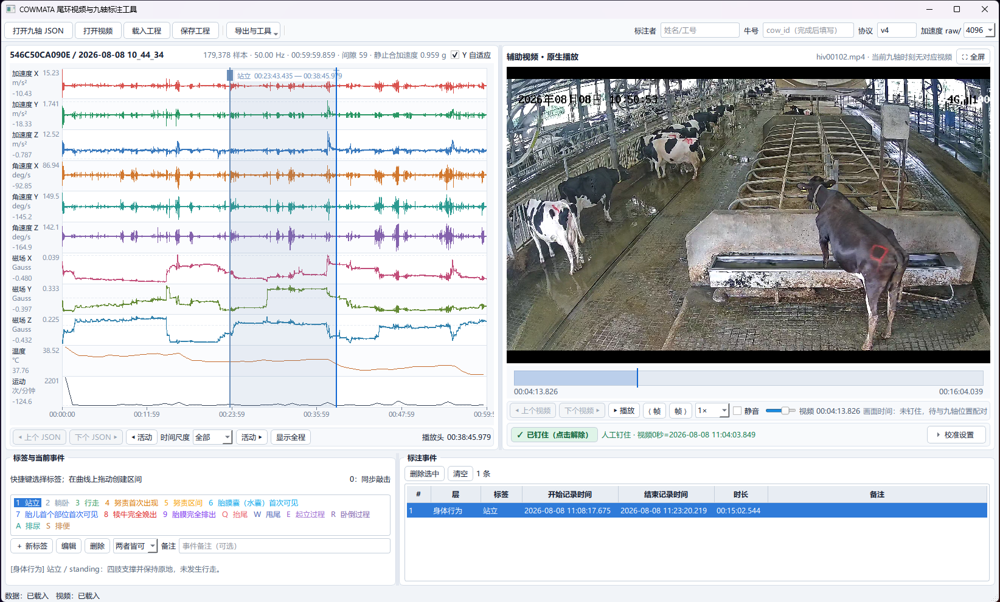
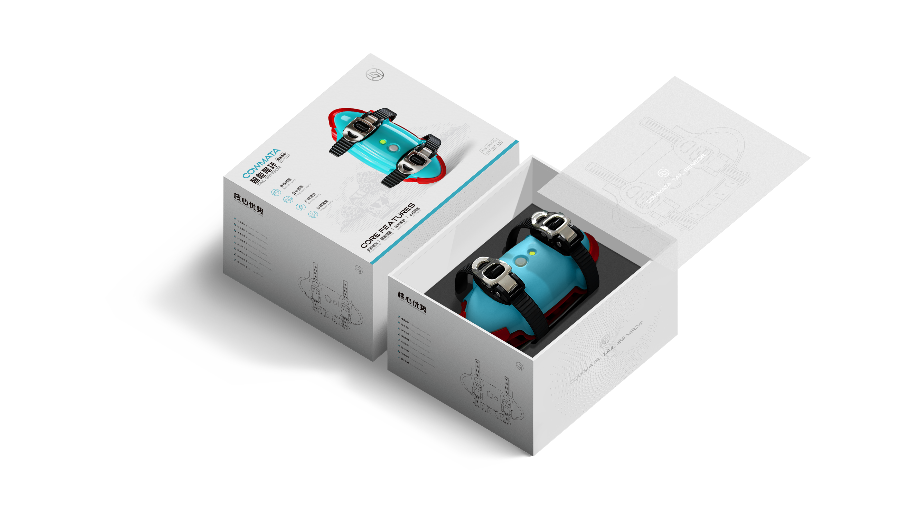

<div align="center">
<a href="https://www.cowmata.com/"></a>

# COWMATA · 牛只繁殖与健康监测

**让牛群关键事件，从人盯死守走向连续感知。**

[](https://github.com/zxq309/cowmata/actions/workflows/docs.yml)


[English](README.md) · [简体中文](README.zh-CN.md) · [COWMATA](https://github.com/zxq309/cowmata)

</div>

<p align="center"><br><em>尾环佩戴现场：把离散巡栏，延伸为连续观测。</em></p>

## 项目做什么

COWMATA 是杨凌园上园智能科技有限公司研发的智能牛尾环与配套软件项目，面向奶牛繁殖、行为和健康监测。尾环采集九轴 IMU，并同步采集温度与 PPG；视频为行为和产犊事件提供可复核依据。

项目目标是把连续观测转成行为时间线和风险证据，为牧场繁殖管理与健康巡检提供参考。当前研发与现场实验优先推进产犊；发情、妊娠和健康／疫病风险分别作为后续研究任务建设。

**本仓集中说明产品、应用场景、团队、进展与组件分工。** 三个专业仓只维护各自的功能、接口、使用与验证。

## 硬件与应用场景

产品以牛尾根部佩戴的尾环为感知入口，配合同步视频标注、行为识别算法和综合决策研究。现有产品素材展示牧场版与兽医版两类应用定位。

<table><tr><td align="center" width="50%"><br>牧场版</td><td align="center" width="50%"><br>兽医版</td></tr></table>

| 产品／组件 | 面向场景 | 在项目中的作用 |
|---|---|---|
| 尾环·牧场版 | 牧场繁殖管理与日常观测 | 提供连续传感数据，支撑发情、妊娠、产犊相关监测研究 |
| 尾环·兽医版 | 繁殖与动物健康观察 | 提供辅助观测，用于专业复核与研究 |
| 视频—IMU 标注工具 | 数据采集、实验和人工复核 | 对齐视频与信号，形成可追溯状态／事件标签 |
| 行为识别与决策软件 | 算法开发和实验评估 | 分别输出行为事件与多模态辅助证据 |

完整牧场服务、业务前后端和统一告警部署尚未由这四个仓交付。产品信息入口：[COWMATA 官网](https://www.cowmata.com/)；素材来源与使用范围见 [assets/README.md](assets/README.md)。

## 从现场到软件

**佩戴采集 → 视频复核 → 行为时间线 → 风险证据 → 人工处置。** 尾环记录变化，标注工具建立真值，算法识别事件，决策研究把多种观测汇成可复核的提示。

<p align="center"><br><em>视频与传感器对齐：让每个行为标签都有可复核的现场依据。</em></p>

<p align="center"><a href="https://zxq309.github.io/cowmata/showcase/"></a><br><strong><a href="https://zxq309.github.io/cowmata/showcase/">查看产品影像与现场视频 →</a></strong></p>

影像页收录产品、佩戴现场、软件界面和产犊视频。素材提取自 2026-08-26 项目 PPT；产品展示不代表本仓已交付完整平台，产犊视频用于说明观察场景。

## 研发进展与能力边界

| 方向 | 当前已有 | 下一步 |
|---|---|---|
| 行为与事件识别 | 连续 IMU 训练／推理基线、候选复核流程、按牛评估 | 扩充标签、困难负样本和独立验证 |
| 产犊 | 温度与活动量辅助证据模块，现场实验持续开展 | 接入行为事件、融合标定及连续预警验证 |
| 发情与妊娠 | 总体研究与数据采集方向 | 建立对应真值、任务模型和独立验证 |
| 健康／疫病风险 | 多模态数据与可行性研究方向 | 完善质量评估、对照数据和任务验证 |

已有辅助证据不等于已标定产犊概率，产品方向也不等于已完成诊断能力。各专业仓记录具体软件和实验版本。

## 四个仓库，一个项目

| 仓库 | 主要职责 |
|---|---|
| [cowmata](https://github.com/zxq309/cowmata) | 总体架构、路线图与演示 |
| [cowmata-tailring](https://github.com/zxq309/cowmata-tailring) | 行为事件训练、推理与评估 |
| [cowmata-risk](https://github.com/zxq309/cowmata-risk) | 综合决策研究；公开仓库 |
| [cattle-tail-ring-annotator](https://github.com/zxq309/cattle-tail-ring-annotator) | 人工标注与候选复核 |

## 当前总体框架

<p align="center"></p>

## 查看总体演示

**[直接打开在线交互演示 →](https://zxq309.github.io/cowmata/demo/?lang=zh)**，无需安装；同一页面也可离线打开。

<p align="center"></p>

克隆本仓后，用浏览器打开 **[demo/index.html](demo/index.html)**。页面支持中英文切换、正常观测／证据变化／缺失数据场景，可离线使用。页面数值是示意数据，不在浏览器中运行识别或风险模型。

```sh
git clone https://github.com/zxq309/cowmata.git
cd cowmata
python -m http.server 8000 --bind 127.0.0.1
# Open http://127.0.0.1:8000/demo/
```

要运行**真实组件**，请看[演示指南](docs/DEMO.zh-CN.md)：运行器执行识别演示，也可执行已授权决策仓的演示，记录组件提交号，任一选定组件失败即返回失败。两个演示独立运行，尚未接成已验证融合流水线。

## 文档与复现入口

- [路线图](docs/ROADMAP.md) · [接口提案](docs/INTERFACES.md)
- [固定组件提交号](components.json) · [维护约定](docs/MAINTENANCE.md)
- [演示指南](docs/DEMO.zh-CN.md) · [素材来源](assets/README.md)
- [贡献指南](CONTRIBUTING.md) · [安全说明](SECURITY.md) · [权利声明](NOTICE)

## 团队

研发主体为**杨凌园上园智能科技有限公司**，品牌为 **COWMATA**。团队信息统一在此维护；各软件的贡献与引用信息保留在所属仓的贡献记录和引用文件中。

| 成员 | 职务／单位 |
|---|---|
| 张向清（Xiangqing Zhang） | 杨凌园上园智能科技有限公司 CTO；延安大学；西北工业大学博士后 |
| 张亚龙（Yalong Zhang） | 杨凌园上园智能科技有限公司创始人 |
| 焦腾宇（Tengyu Jiao） | 延安大学 |
| 赵亚晨（Yachen Zhao） | 延安大学 |

<p align="center"></p>

公司与产品咨询：[官网联系入口](https://www.cowmata.com/contact/)。软件问题请进入对应专业仓提交可复现问题；跨组件接口和总体路线问题在本仓讨论。

## 最新更新

**2026-09-07** — 修正张向清姓名、补充西北工业大学博士后任职；采用 PPT 原始产品与现场素材，增加双语影像页，统一图片居中。[完整更新记录](CHANGELOG.md)。
