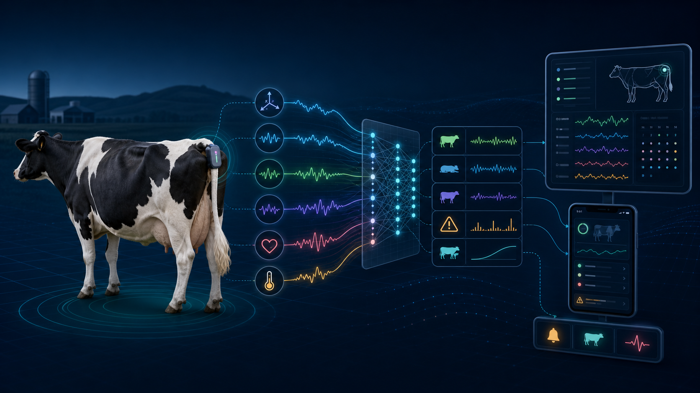
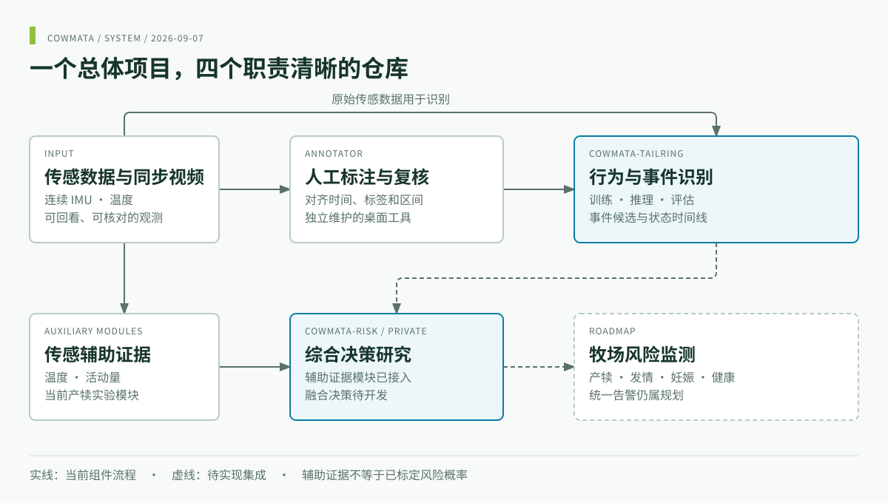
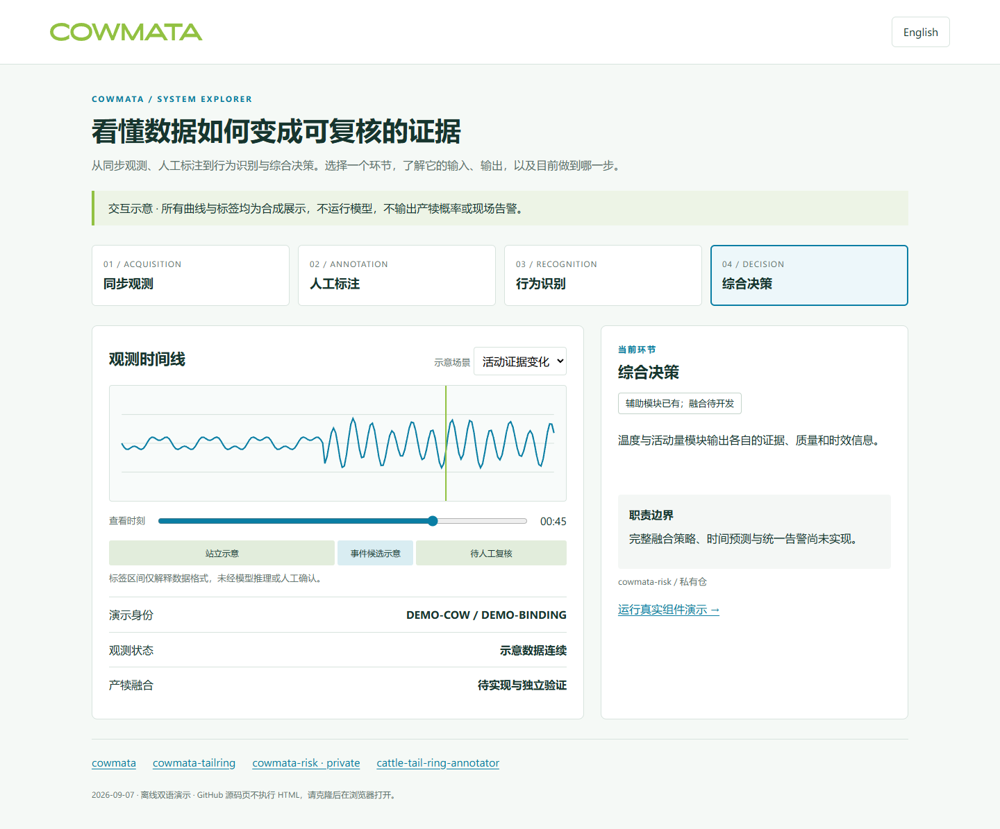
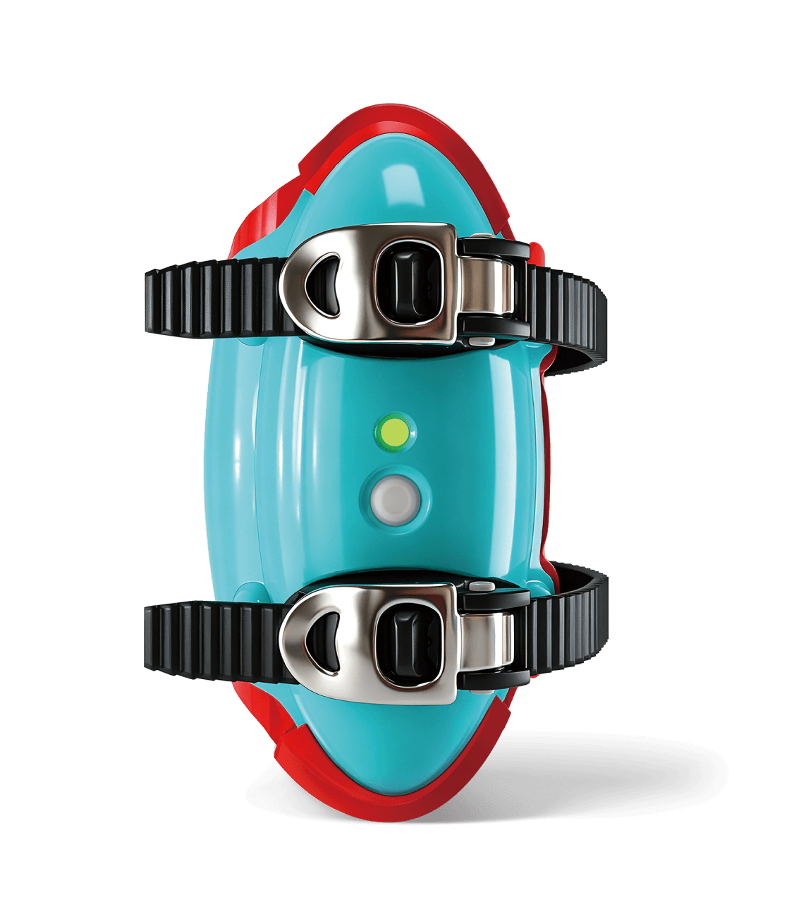

<div align="center">
<a href="https://www.cowmata.com/"></a>

# COWMATA · 牛只繁殖与健康监测

**从尾环感知，到可复核的行为识别与风险证据。**

[](https://github.com/zxq309/cowmata/actions/workflows/docs.yml)


[English](README.md) · [简体中文](README.zh-CN.md) · [COWMATA](https://github.com/zxq309/cowmata)

</div>



*总体概念图，非已部署应用截图。*

## 最新更新

**2026-09-07** — 完善双语项目首页，归集产品素材，新增总体框图、在线／离线交互演示和组件演示入口。完整记录见 [CHANGELOG.md](CHANGELOG.md)。文档更新日期与组件软件发布版本分开记录。

## 项目做什么

COWMATA 围绕尾环传感、同步视频复核、行为识别与综合决策，建设牛只繁殖和健康监测系统。当前实验重点是产犊；发情、妊娠和健康监测属于总体方向，需要各自的数据和验证。

## 四个仓库，一个项目

| 仓库 | 主要职责 |
|---|---|
| [cowmata](https://github.com/zxq309/cowmata) | 总体架构、路线图与演示 |
| [cowmata-tailring](https://github.com/zxq309/cowmata-tailring) | 行为事件训练、推理与评估 |
| [cowmata-risk](https://github.com/zxq309/cowmata-risk) | 综合决策研究；私有，需授权访问 |
| [cattle-tail-ring-annotator](https://github.com/zxq309/cattle-tail-ring-annotator) | 人工标注与候选复核 |

## 当前总体框架



**已有：** 标注工作台、行为识别基线、温度与活动量证据模块。**待完成：** 行为到决策适配、融合标定和统一告警。公开工具可独立使用，访问私有决策仓需要授权。

## 查看总体演示

**[直接打开在线交互演示 →](https://zxq309.github.io/cowmata/demo/?lang=zh)**，无需安装；同一页面也可离线打开。



克隆本仓后，用浏览器打开 **[demo/index.html](demo/index.html)**。页面支持中英文切换、正常观测／证据变化／缺失数据场景，可离线使用。页面数值是示意数据，不在浏览器中运行识别或风险模型。

```sh
git clone https://github.com/zxq309/cowmata.git
cd cowmata
python -m http.server 8000 --bind 127.0.0.1
# Open http://127.0.0.1:8000/demo/
```

要运行**真实组件**，请看[演示指南](docs/DEMO.zh-CN.md)：运行器执行识别演示，也可执行已授权决策仓的演示，记录组件提交号，任一选定组件失败即返回失败。两个演示独立运行，尚未接成已验证融合流水线。

## 硬件与应用场景

<table><tr><td align="center" width="50%"><br>牧场版</td><td align="center" width="50%"><br>兽医版</td></tr></table>

官方产品素材从原算法仓归集到此。产品应用场景覆盖面大于当前软件已经验证的能力范围。

## 文档与复现入口

- [路线图](docs/ROADMAP.md) · [接口提案](docs/INTERFACES.md)
- [固定组件提交号](components.json) · [维护约定](docs/MAINTENANCE.md)
- [演示指南](docs/DEMO.zh-CN.md) · [素材来源](assets/README.md)
- [贡献指南](CONTRIBUTING.md) · [安全说明](SECURITY.md) · [权利声明](NOTICE)

## 团队

由杨凌园上园智能科技有限公司 COWMATA 团队研发，与延安大学开展研究合作。张相清 · 张亚龙 · 焦腾宇 · 赵亚晨。
